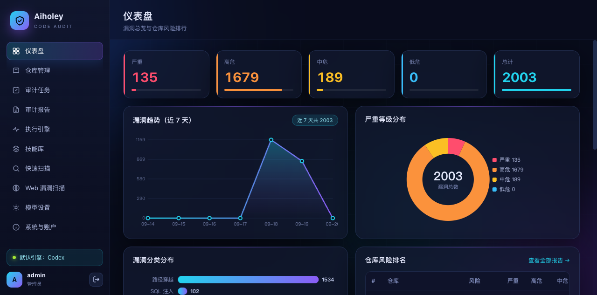
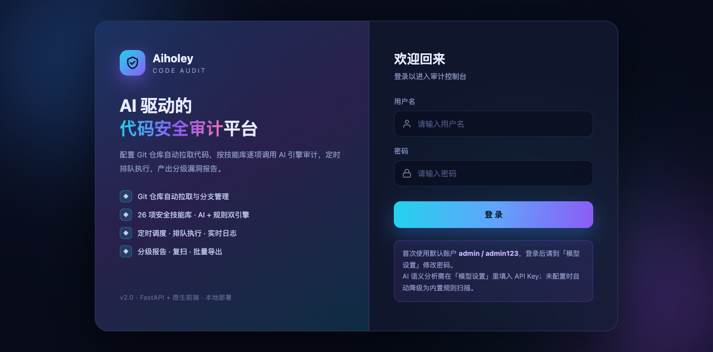
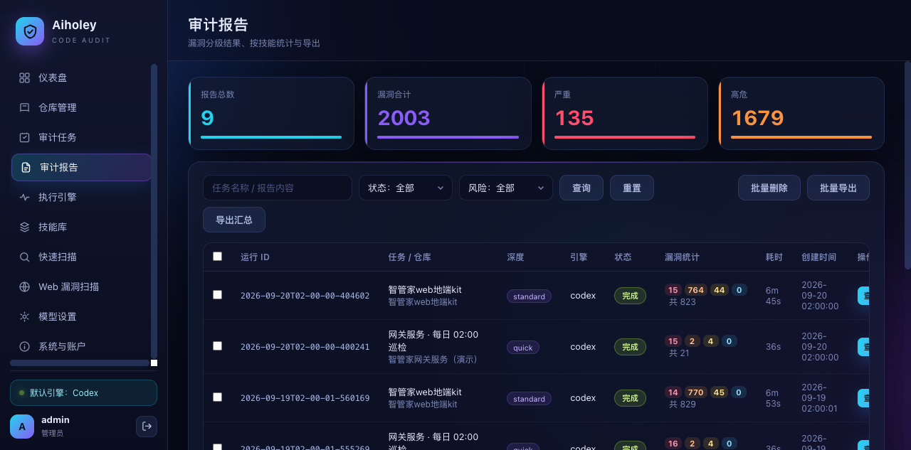
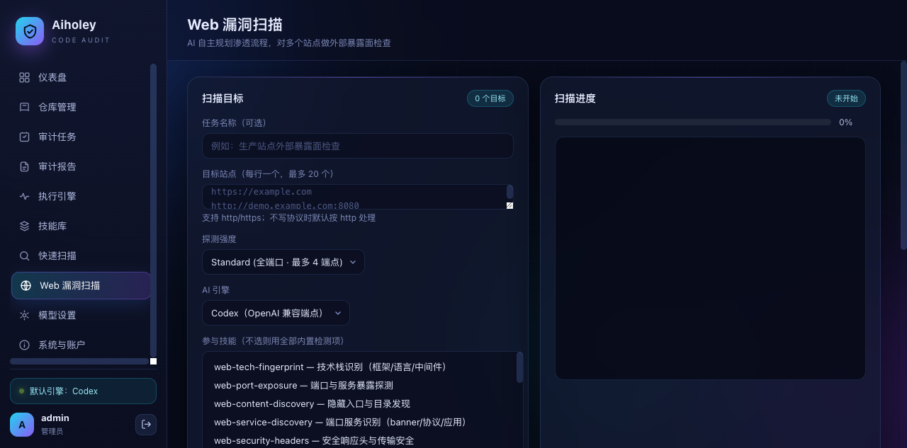

<div align="center">

# Aiholey · AI 代码审计平台

**自托管的一体化安全审计平台 —— Git 仓库代码审计 + Web 漏洞扫描，一个 Docker 容器全搞定。**

规则引擎打底、大模型（任意 OpenAI 兼容接口）做语义增强与自主渗透规划。
后端 FastAPI + SQLite，前端零依赖原生 HTML / CSS / JS，不配置 API Key 也能跑纯规则扫描。

[](https://www.python.org/)
[](https://fastapi.tiangolo.com/)
[](#安装与部署)
[](#许可证)
[](#安装与部署)

</div>

---

## 目录

- [界面预览](#界面预览)
- [功能特性](#功能特性)
- [安装与部署](#安装与部署)
  - [镜像一键部署（推荐 · amd64 Linux）](#镜像一键部署推荐--amd64-linux)
  - [编译部署（源码构建 · 任意架构）](#编译部署源码构建--任意架构)
  - [环境要求](#环境要求)
  - [本地开发（不用 Docker）](#本地开发不用-docker)
- [AI 引擎配置（可选）](#ai-引擎配置可选)
- [工作原理](#工作原理)
- [安全机制](#安全机制)
- [项目结构](#项目结构)
- [常见问题](#常见问题)
- [许可证](#许可证)

---

## 界面预览



> 仪表盘：漏洞等级统计卡、近 7 天趋势、等级/分类分布、仓库风险排名。
> 左侧导航覆盖审计全流程（仓库 / 任务 / 报告 / 引擎 / 技能库 / 快速扫描 / Web 漏扫 / 模型 / 账户）。

<details>
<summary><b>更多截图</b></summary>

**登录页** —— JWT 双令牌认证，失败限流锁定，不枚举账号是否存在



**审计报告** —— 分级统计、按技能筛选、单条/批量删除、批量导出整合报告，HTML 报告可直接打印为 PDF



**Web 漏洞扫描** —— 站点外部暴露面检查：端口发现 → 服务识别 → AI 自主规划渗透流程，三档探测强度



</details>

---

## 功能特性

### 代码审计

| 功能 | 说明 |
| --- | --- |
| **仓库管理** | Git 仓库配置（地址 / 分支 / 账密 Token / SSH Key），批量添加、批量测试连接、手动拉取 |
| **审计任务** | 绑定仓库 + 深度 + 引擎 + 调度（手动 / 定时间隔 / cron / 单次）；运行、停止、实时日志 |
| **审计报告** | 漏洞统计与按技能统计；查看详情、下载 HTML（可打印 PDF）/ Markdown / JSON、复扫、批量导出 |
| **规则预筛** | 23 条内置正则（凭证泄漏 / SQL 注入 / 命令注入 / 反序列化 / 路径穿越…），秒级初筛 |
| **AI 项目适配** | 识别技术栈后自动产出审计增强规则与项目特有模式，越扫越准 |
| **技能库** | 29 项内置审计技能，增删改查、启停、恢复出厂提示词；支持 `${scanPath}` 等占位符 |
| **快速扫描** | 不建任务，直接扫服务器任意目录（内建目录浏览器）或已拉取仓库 |
| **执行引擎** | 扫描子进程实时监控（PID / 时长 / 进度 / 工作目录），可终止，3 秒自动刷新 |

### Web 漏洞扫描

| 功能 | 说明 |
| --- | --- |
| **端口发现** | quick 扫常见端口 / standard 以上扫全 65535（asyncio 并发，全端口约 3 秒）+ 服务识别 |
| **按端口分派** | HTTP 端点走完整 Web 检测链；Redis / ES / Docker / MySQL 等数据端口走未授权访问检测 |
| **27 项只读探测** | XSS / SQLi / 目录遍历 / CSRF / CRLF / 组件 CVE / 凭据泄露 / API 审计 / WAF 识别 / TLS 弱配置… |
| **AI 自主规划** | 每轮把总纲 + 技能 + 工具清单 + 已有结果交给模型，由模型决定下一步渗透动作 |
| **确定性补齐** | AI 步数耗尽时自动补跑未覆盖的确定性检查，避免整类漏报 |
| **三档强度** | quick / standard / deep，独立于审计队列，点完即等结果 |

### 工程细节

- **不配 Key 也能用** —— 未配置模型时自动降级为纯内置规则扫描，照样产出完整报告。
- **双引擎** —— Codex / Claude Code 两套引擎的 Key / 模型 / Base URL 分开配置，界面上连接测试。
- **报告可打印** —— HTML 报告是单文件离线页面，内置打印按钮，一键存 PDF。
- **全部数据本地化** —— SQLite 单文件 + 报告目录，备份 = 拷贝一个 `docker-data/` 目录。
- **规则有回归测试** —— 23 条内置正则配正例/反例用例（`backend/tests/`），
  改规则跑一遍，既不误报回归也不漏报。

---

## 安装与部署

### 镜像一键部署（推荐 · amd64 Linux）

不需要 clone 代码，直接拉取预构建镜像，三条命令搞定：

```bash
# 1. 拉取镜像（linux/amd64）
docker pull paolagaren1/aiholey:latest

# 2. 创建数据卷（数据库 / 报告 / JWT 密钥，删容器不丢数据）
docker volume create aiholey-data

# 3. 启动
docker run -d --name aiholey \
  -p 8787:8787 \
  -v aiholey-data:/app/data \
  --restart unless-stopped \
  paolagaren1/aiholey:latest
```

等 `docker ps` 的 STATUS 变成 **(healthy)**（约 15~30 秒），打开
**<http://服务器IP:8787>** → 默认账号 **admin / admin123**
（首次登录后请立即到「系统与账户」修改密码）。

> 防火墙记得放行 8787 端口（CentOS：`firewall-cmd --add-port=8787/tcp --permanent && firewall-cmd --reload`；
> 云服务器另需放行安全组）。

常用命令：

```bash
docker logs -f aiholey          # 看日志
docker restart aiholey          # 重启
docker rm -f aiholey            # 删除容器（数据保留在 aiholey-data 卷里）

# 升级版本（数据不丢）
docker pull paolagaren1/aiholey:latest
docker rm -f aiholey
# 再执行一遍上面的 docker run
```

自定义：

```bash
# 换端口（例：9000）
docker run -d --name aiholey -p 9000:8787 -v aiholey-data:/app/data \
  --restart unless-stopped paolagaren1/aiholey:latest

# 首次初始化的管理员账号（仅空库初始化时生效）
docker run -d ... -e AIHOLEY_USER=myadmin -e AIHOLEY_PASSWORD='强密码' \
  paolagaren1/aiholey:latest

# 想直接看到数据文件：用 bind mount 替代命名卷
docker run -d --name aiholey -p 8787:8787 -v /opt/aiholey-data:/app/data \
  --restart unless-stopped paolagaren1/aiholey:latest
```

> **ARM 机器（Apple Silicon / ARM 服务器）**：预构建镜像目前只提供 amd64，
> ARM 环境请用下面的编译部署，在本机构建原生镜像。

### 编译部署（源码构建 · 任意架构）

```bash
git clone https://github.com/2777484478/aiholey.git
cd aiholey
./docker-deploy.sh
```

脚本自动完成四件事：

```
1. 停掉宿主机上可能存在的本地实例（避免抢 8787 端口）
2. 构建镜像 aiholey:latest（约 260MB）
3. 若检测到旧版部署的 data/ 目录，自动把数据迁移到 docker-data/（全新部署则跳过）
4. docker compose 启动容器并等待健康检查通过
```

完成后打开 **<http://127.0.0.1:8787>** → 默认账号 **admin / admin123**
（首次登录后请立即到「系统与账户」修改密码）。

常用命令：

```bash
docker logs -f aiholey          # 看日志
docker compose restart          # 重启
docker compose down             # 停止并删除容器（数据保留在 ./docker-data/）
./docker-deploy.sh --rebuild    # 代码更新后强制无缓存重建并重新部署
```

**数据与持久化**：所有运行时数据都在 **`./docker-data/`**（SQLite 数据库、审计报告、
扫描产物、JWT 密钥），容器删了数据也在。**备份 = 拷贝这一个目录**。

自定义：

```bash
# 换端口（例：9000）：编辑 docker-compose.yml 的 ports，或
docker run -d --name aiholey -p 9000:8787 -v "$PWD/docker-data:/app/data" \
  --restart unless-stopped aiholey:latest

# 首次初始化的管理员账号（仅空库初始化时生效）
docker run -d ... -e AIHOLEY_USER=myadmin -e AIHOLEY_PASSWORD='强密码' aiholey:latest

# 有外网的环境可覆盖基镜像与 pip 源
BASE_IMAGE=python:3.13-slim PIP_INDEX_URL=https://pypi.org/simple docker compose build
```

> **网络受限环境**：Dockerfile 默认使用国内镜像站基镜像（`docker.m.daocloud.io`）+
> 阿里云 pip 源，Docker Hub 不可达的网络也能直接构建；两个值都是 `ARG`，可按上面方式覆盖。

### 环境要求

| 依赖 | 镜像一键部署 | 编译部署 |
| --- | --- | --- |
| Docker Engine | **≥ 20.10** | **≥ 20.10**（需含 BuildKit） |
| Docker Compose | 不需要 | **v2**（`docker compose` 子命令，Linux 装 `docker-compose-plugin`） |
| 架构 | `linux/amd64` | `linux/amd64`、`linux/arm64` 均可（本机构建原生镜像） |
| Linux 发行版 | 任意能跑上述 Docker 的发行版（Ubuntu 20.04+ / Debian 11+ / CentOS 7+ 等实测均可） | 同左 |
| Docker Desktop（Mac/Windows） | —— | ≥ 4.0，Apple Silicon（arm64）与 Intel（amd64）均可 |
| 资源 | 内存 ≥ 512MB，磁盘 ≥ 1GB（镜像约 260MB + 数据） | 同左 |

### 本地开发（不用 Docker）

要求 Python **≥ 3.10**、Git ≥ 2.20（审计功能依赖 `git clone` 子命令）：

```bash
./start.sh          # 首次自动建虚拟环境并装依赖（走国内镜像）
./stop.sh           # 停止
PORT=9000 ./start.sh
```

---

## AI 引擎配置（可选）

不配置也能跑（纯规则扫描）。要启用 AI 语义分析与自主渗透规划，到界面
「模型设置」填入任意 **OpenAI 兼容接口**（阿里云百炼 / OpenAI / DeepSeek / 本地 vLLM）：

- Base URL：如 `https://dashscope.aliyuncs.com/compatible-mode/v1`
- API Key + 模型名（如 `qwen-plus`）

也可复制 `.env.example` 为 `.env` 预填（本地开发模式生效；Docker 模式在
`docker-compose.yml` 的 `environment` 里加同名变量）。

### 快速体验

示例仓库已内置，启动后直接在界面里操作：

```text
仓库管理 → 新增仓库 → 地址填 <项目路径>/examples/demo-repo.git → 拉取
审计任务 → 新增任务 → 选该仓库 → 运行
```

---

## 工作原理

### 代码审计链路

```
① 拉取代码   git clone/fetch 到 data/repos/<id>（凭据/SSH Key 注入，日志脱敏）
② 收集文件   按扩展名与忽略目录筛选，执行 gitignore 与体积上限
③ 规则扫描   23 条内置正则，与 AI 分析**并行独立**执行（结果在报告里合并去重，不喂给模型）
④ 项目适配   AI 识别技术栈，产出审计增强规则与项目特有模式（无 Key 时跳过）
⑤ 技能分析   按启用技能逐块分析，产出结构化 JSON
⑥ 去重分级   同文件同行合并（AI 优先于规则），按等级排序统计
⑦ 生成报告   Markdown + JSON + 可打印单文件 HTML
```

### Web 漏洞扫描链路

```
① 目标确认   归一化输入，逐个探测可达性
② 端口发现   quick 常见端口 / standard+ 全 65535（asyncio 并发，全端口约 3 秒）+ 服务识别
③ 按端口分派 HTTP → 完整 Web 检测链；Redis/ES/Docker/MySQL… → 未授权只读检测
④ 内容发现   目录遍历、敏感文件、备份泄漏、信息泄漏
⑤ 安全配置   安全响应头、Cookie 属性、CORS、危险方法、开放重定向
⑥ 参数注入   反射 XSS、错误型 SQLi、路径穿越、模板注入、命令注入回显
⑦ AI 研判    每轮把总纲+技能+工具清单+已有结果交给模型，模型决定下一步
⑧ 补齐去重   AI 步数耗尽时自动补跑未覆盖的确定性检查，避免整类漏报
⑨ 生成报告   report.md / report.html / findings.json
```

### 规则误报治理

内置规则是正则匹配，能力边界很清楚：**「出现某字符串」不等于「有漏洞」**。
判定必须还原到攻击路径本身——路径穿越看「外部输入有没有进入文件系统 API」，
SSRF 看「HTTP 客户端有没有真的发出请求」，而不是源码里有没有 `../` 或 `HttpClient`
这个词。反例：早期 `path-traversal` 用 `\.\.[/\\]` 直接匹配，在一个 Angular
仓库里刷出 805 条误报、占报告 90%，把真问题全淹了。

规则支持六类上下文约束来压误报：

| 约束 | 作用 | 例子 |
| --- | --- | --- |
| `line_require` | 本行还须再命中其一 | 路径穿越要求同行出现 `request.` / `@RequestParam` 等外部输入 |
| `line_exclude` | 本行命中任一即放过 | 排除 `path.contains("../")` 这类校验代码、日志行 |
| `context_require` | 「本行 + 下一行」拼成窗口再匹配 | 私钥块要求标记行之后真有 base64 正文，而不是文档在描述密钥格式 |
| `file_contains` | 整个文件含该特征才评判 | `EXTERNAL_INPUT_HINTS`：只有真的会收到外部输入的文件才评判路径穿越 / SSRF |
| `severity_downgrade` | 命中则严重度降一级 | `"Select * From " + tableName` 拼的是表名（无法用占位符绑定），critical 降 high |
| `skip_tests` | 跳过测试文件 | 排除 spec/test 里的夹具数据（**凭证类规则不跳过**） |

两条最容易被忽略的原则：

- **变量名不是污点源**。`ioutil.ReadFile(filePath)` 里的 `filePath`、统一 HTTP 封装类里
  的 `url` 参数，都只是名字恰好叫这个——拿它们当证据会把工具函数整片报成漏洞。
  正则看不到跨行数据流，所以补一层**文件级**判据：这个文件接不接外部输入。
- **命令行参数不算信任边界**。CLI 的 `argv` 由调用者自己控制，调用者本来就能读那个文件，
  把它算成外部输入只会让「工具程序读自己写死的路径」变成路径穿越。

改规则必须配回归测试（正例：真实漏洞形态必须命中；反例：历史误报样本必须不命中）：

```bash
.venv/bin/python -m unittest discover -s backend/tests -t . -v
```

只收紧不加反例等于没有回归——**误报看得见（条数异常），漏报看不见（报告说"没发现"）**，
所以每次改判据都要双向验证。同理，**放宽也要验证**：一次误报治理顺手扩大 SSRF 模式，
命中数从 5 涨到 15，就是一个只看收紧方向的反例。

AI 层是另一类问题：它不是匹配错字符串，而是**基于看不到的代码做保守推断**并给出 critical
（「若 utils.ts 中 encrypt 使用固定密钥，则…」）。提示词里设了证据门槛，代码里再做一层
确定性兜底——命中假设式措辞（可能 / 若 / 未给出实现 / 无法确认）就降一级、置信度压到 low。
每条命中的 `confidence` 会写进报告：`high` 是可见代码直接佐证，`low` 是「需要人工确认的线索」。

---

## 安全机制

- **JWT 双令牌认证** —— access（HS256，30 分钟）+ refresh（随机串哈希入库，7 天，
  Cookie path 限定 `/api/auth`）；固定算法校验，免疫 `alg:none` 与算法混淆攻击。
- **即时吊销** —— `token_version` 自增使全部已签发令牌当场失效；refresh 轮换 +
  复用检测（旧令牌复用 → 吊销整个会话家族）。
- **CSRF 三重校验** —— double-submit cookie + 请求头 + JWT 内签名声明比对；
  跨站 `Origin` 直接 403。
- **登录防爆破** —— 失败计数限流 + 临时锁定，且不枚举账号是否存在。
- **安全响应头** —— CSP（报告页单独收紧到 `default-src 'none'`，打印脚本走 sha256 白名单）、
  `X-Frame-Options: DENY`、`nosniff`、接口禁缓存；报告模板全字段转义防存储型 XSS。
- **容器安全** —— 非 root 用户运行、只暴露一个端口、`--no-server-header` 不泄露实现。
- **会话管理** —— 「系统与账户」里可查看活跃会话、踢出指定设备、一键退出其它设备。

---

## 项目结构

```
aiholey/
├── backend/                  FastAPI 应用
│   ├── main.py               应用装配（安全头中间件 / 路由保护）
│   ├── config.py             全部配置走环境变量
│   ├── core/                 认证(JWT) / 数据库 / 调度 / git 操作 / 扫描引擎 / 报告生成
│   │   ├── rules.py          23 条内置正则规则（带上下文约束，压误报）
│   │   ├── jwt_util.py       零依赖 HS256 实现（固定算法、强制 exp/iss/aud/typ）
│   │   └── webscan/          Web 漏扫：端口扫描 + 27 个探测工具 + AI 规划
│   ├── routers/              auth / 配置 / 任务 / 报告 / 漏扫 API
│   └── tests/                回归测试：规则（正例必须命中 / 反例必须不命中）+ AI 结论校准
├── frontend/                 零依赖原生前端（HTML/CSS/JS，无构建步骤）
├── examples/                 示例仓库（demo-repo.git + demo-vuln），内置体验用
├── docs/                     界面截图
├── Dockerfile                一体化镜像（入口降权非 root 运行 + 健康检查）
├── docker-entrypoint.sh      容器入口：修正挂载卷属主后降权启动（Linux 权限兼容）
├── docker-compose.yml        单服务编排
├── docker-deploy.sh          一键部署：停旧实例→构建→迁移数据→起容器
├── requirements.txt
├── start.sh / stop.sh        本地开发启动脚本
└── LICENSE                   MIT 许可证全文
```

---

## 常见问题

<details>
<summary><b>构建镜像时拉不动基础镜像？</b></summary>

Dockerfile 默认已走国内镜像站；若你的网络反过来（可直连 Docker Hub），用

```bash
BASE_IMAGE=python:3.13-slim PIP_INDEX_URL=https://pypi.org/simple docker compose build
```
</details>

<details>
<summary><b>忘记密码？</b></summary>

删库重初始化（数据会丢）：

```bash
docker compose down && rm -rf docker-data && ./docker-deploy.sh
```

或者挂载卷进容器改 `users` 表。
</details>

<details>
<summary><b>审计功能在容器里提示 git 不存在？</b></summary>

官方 Dockerfile 已内置 `git` 与 `openssh-client`；若是自己改过的镜像，
确保安装这两个包（审计功能依赖 `git clone` 子命令）。
</details>

<details>
<summary><b>不配置大模型 API Key 能用吗？</b></summary>

能。未配置时自动降级为纯内置规则扫描：23 条审计正则 + 27 项 Web 只读探测照常工作，
报告照常产出。配置 Key 后额外获得 AI 项目适配、语义分析和自主渗透规划。
</details>

<details>
<summary><b>Linux 服务器上容器起不来，日志报 <code>Permission denied: '/app/data/repos'</code>？</b></summary>

这是**旧版镜像**的问题：容器以非 root 运行，而 Linux 的 bind mount 保留宿主机属主
（用 root 跑部署脚本时 `docker-data/` 是 root:root，容器用户写不进去）。
macOS Docker Desktop 经 virtiofs 抹平了权限所以测不出来。

**2026-09-21 之后的镜像已通过入口脚本自动修复**（root 起入口 → 修正属主 → 降权运行），
拉最新预构建镜像或重新构建即可：

```bash
docker pull paolagaren1/aiholey:latest      # 镜像部署方式
# 或源码构建方式：
git pull && ./docker-deploy.sh --rebuild
```
</details>

<details>
<summary><b>想换端口 / 对外提供服务？</b></summary>

改 `docker-compose.yml` 的 `ports`（如 `"9000:8787"`）后 `docker compose up -d`。
对外提供服务时务必先改掉默认密码，并建议前面挂一层反向代理处理 TLS。
</details>

---

## 许可证

本项目采用 **MIT 许可证**，全文见 [LICENSE](LICENSE)。

你可以自由使用、修改、分发，包括用于商业目的，只需在副本中保留版权声明与本许可声明。

> ⚠️ 两点说明：
> - MIT 覆盖的是**本仓库的代码**，不改变你与模型服务商之间的协议 —— 通过本项目调用
>   阿里云百炼等服务时，仍需遵守服务商自身的条款。
> - 仓库**不含任何 API 密钥**，请自备并妥善保管。Web 漏洞扫描仅用于对你**有权测试**的
>   目标进行只读探测，请勿用于未授权的系统。

<div align="center">

**[⬆ 回到顶部](#aiholey--ai-代码审计平台)**

</div>
